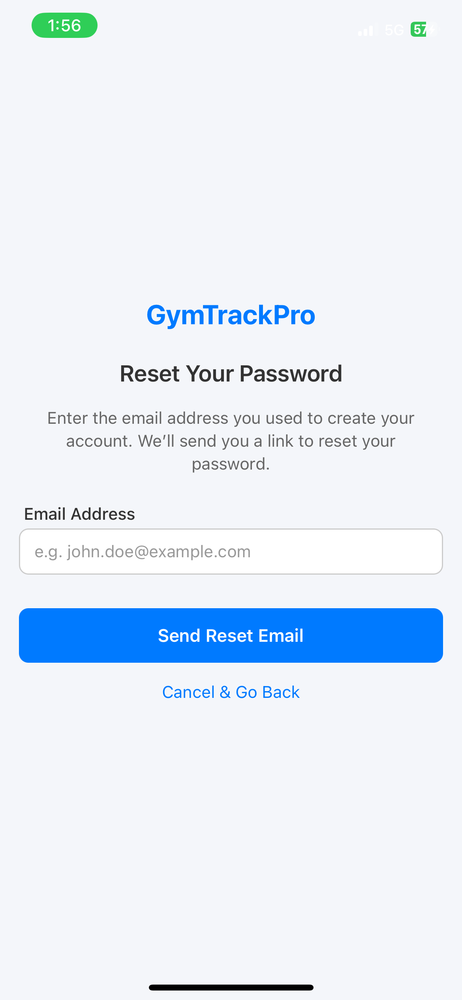

# GymTrackPro

GymTrackPro is a comprehensive fitness tracking application built with **React Native** and **Expo**, designed to help users:

- Log and track workouts  
- Monitor daily weight  
- Manage custom workout plans  
- Follow a personalized fitness goal  
- Interact socially with friends (friend requests, friend profiles)  
- Store all workout and profile data locally (AsyncStorage) and sync with Firebase Firestore  

---

## Table of Contents

1. [Overview](#overview)  
2. [Core Features](#core-features)  
3. [Tech Stack](#tech-stack)  
4. [Project Structure](#project-structure)  
5. [Installation and Setup](#installation-and-setup)  
6. [Screenshots](#screenshots)  
7. [Additional Notes](#additional-notes)  
8. [Contact](#contact)

---

## Overview

GymTrackPro is an all-in-one workout logger and social fitness hub. Sign up securely, set a personal goal, plan workouts, log progress, and connect with friends to see each other’s achievements. The application uses local storage for offline use and synchronizes key data with Firebase Firestore in real time.

### Why GymTrackPro?

- **All-in-One Fitness**: Track workouts, daily weight, recommended progressions, and more.  
- **Social Connectivity**: Manage friend requests, view friend workouts, keep each other motivated.  
- **Flexible Goals**: Choose from pre-set goals (strength, hypertrophy, endurance, tone) or create your own approach.  
- **Intuitive UI**: Use charts, calendars, and a sleek interface to stay on top of your routine.

---

## Core Features

1. **User Authentication**  
   - Sign up with email, password, and basic profile data (age, height, weight).  
   - Login screen with “Remember Me” option.  
   - Password reset via Firebase.

2. **Daily Weight Logging**  
   - Record daily weight logs.  
   - Visualize weight progress in a line chart.

3. **Workout History & Recommendations**  
   - Track workouts by sets, reps, and weight.  
   - Automated suggestions for the next workout’s weight or reps based on history.

4. **Custom Workout Plans**  
   - Create lists like “Chest Day” or “Legs Day”.  
   - Add or remove exercises within these lists.

5. **Favorites**  
   - Quickly bookmark and access preferred exercises.

6. **Social / Friend System**  
   - Search for users, send requests, accept/reject invitations.  
   - View friend profiles (recent workouts, weight logs).

7. **Dark Mode**  
   - Switch themes instantly for different lighting conditions.

---

## Tech Stack

- **React Native (Expo)**  
  - Cross-platform (iOS & Android) development

- **Firebase**  
  - **Auth** for secure login/signup  
  - **Firestore** for real-time data storage

- **AsyncStorage**  
  - Persist user data locally (offline access)

- **React Navigation**  
  - Intuitive navigators (tab, stack)

- **Chart Libraries**  
  - **react-native-chart-kit** for weight and workout progress  
  - **react-native-calendars** for marking completed workouts

---

## Project Structure

A simplified view of the repository:

```
GymTrackPro/
├─ app.json
├─ package.json
├─ App.js
├─ firebase.js
├─ ...
├─ src/
│   ├─ data/
│   │   ├─ gymExercises.json
│   │   ├─ dumbbellExercises.json
│   │   ├─ bodyweightExercises.json
│   │   └─ muscleGroups.json
│   ├─ context/
│   │   ├─ AuthContext.js
│   │   └─ ExerciseContext.js
│   ├─ navigation/
│   │   ├─ AppNavigator.js
│   │   ├─ MainTabNavigator.js
│   │   └─ ...
│   ├─ screens/
│   │   ├─ HomeScreen.js
│   │   ├─ LoginScreen.js
│   │   ├─ SignUpScreen.js
│   │   ├─ WorkoutScreen.js
│   │   ├─ ProfileScreen.js
│   │   ├─ ExercisesScreen.js
│   │   ├─ ExerciseDetailScreen.js
│   │   ├─ SocialScreen.js
│   │   ├─ FriendRequestsScreen.js
│   │   ├─ ForgotPasswordScreen.js
│   │   └─ ...
│   ├─ services/
│   │   ├─ DatabaseService.js
│   │   └─ firebase.js
│   └─ ...
└─ ...
```

---

## Installation and Setup

1. **Clone this repository**:
   ```bash
   git clone https://github.com/your-username/gymtrackpro.git
   cd gymtrackpro
   ```

2. **Install dependencies**:
   ```bash
   npm install
   # or
   yarn install
   ```

3. **Configure Firebase**:
   - In `services/firebase.js`, paste your Firebase project config or verify existing config matches your project settings.

4. **Run the project**:
   ```bash
   npm start
   # or
   expo start
   ```
   - This launches the Expo Developer Tools in your browser.  
   - Use the **iOS Simulator**, **Android Emulator**, or **Expo Go** on a physical device to open the app.

5. **Optional: Generate native builds**:
   ```bash
   expo run:android
   expo run:ios
   ```

---

## Screenshots

### Login Screen


### Sign Up Screen


### Home Tab


### Exercises Tab


### Workout Tab


### Logging a Workout


### Profile Tab


### Reset Password


### Social Tab


### Workout Detail (Example 1)


### Workout Detail (Example 2)


---

## Additional Notes

- **Offline + Online**: AsyncStorage ensures local data availability, while Firestore syncs in real time whenever online.
- **Dark Mode**: A quick toggle for user preference, stored in React Context.
- **Easily Extendable**: Add new exercise data, features like push notifications, or advanced analytics.

### Potential Improvements
- Push notifications for friend requests.  
- External integrations (e.g., wearable device data).  
- More detailed analytics (bar charts, weekly trends, etc.).

---

## Contact

Feel free to reach out for any questions or collaboration requests!

**Thanks for checking out GymTrackPro!** If you found this project helpful or inspiring, please star it ⭐ and follow my GitHub for more projects.