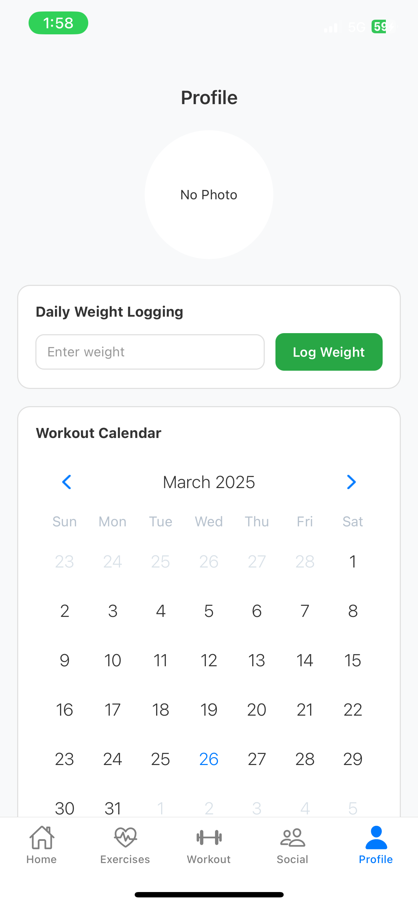

# GymTrackPro

GymTrackPro is a comprehensive fitness tracking application built with **React Native** and **Expo**, designed to help users:

- Log and track workouts  
- Monitor daily weight  
- Manage custom workout plans  
- Follow a personalized fitness goal  
- Interact socially with friends (friend requests, friend profiles)  
- Store all workout and profile data locally (AsyncStorage) and sync with Firebase Firestore  

---

## Table of Contents

1. [Overview](#overview)  
2. [Core Features](#core-features)  
3. [Tech Stack](#tech-stack)  
4. [Project Structure](#project-structure)  
5. [Installation and Setup](#installation-and-setup)  
6. [Screenshots](#screenshots)  
7. [Additional Notes](#additional-notes)  
8. [Contact](#contact)

---

## Overview

GymTrackPro is an all-in-one workout logger and social fitness hub. Sign up securely, set a personal goal, plan workouts, log progress, and connect with friends to see each other's achievements. The application uses local storage for offline use and synchronizes key data with Firebase Firestore in real time.

### Why GymTrackPro?

- **All-in-One Fitness**: Track workouts, daily weight, recommended progressions, and more.  
- **Social Connectivity**: Manage friend requests, view friend workouts, keep each other motivated.  
- **Flexible Goals**: Choose from pre-set goals (strength, hypertrophy, endurance, tone) or create your own approach.  
- **Intuitive UI**: Use charts, calendars, and a sleek interface to stay on top of your routine.

---

## Core Features

1. **User Authentication**  
   - Sign up with email, password, and basic profile data (age, height, weight).  
   - Login screen with "Remember Me" option.  
   - Password reset via Firebase.

2. **Daily Weight Logging**  
   - Record daily weight logs.  
   - Visualize weight progress in a line chart.

3. **Workout History & Recommendations**  
   - Track workouts by sets, reps, and weight.  
   - Automated suggestions for the next workout's weight or reps based on history.

4. **Custom Workout Plans**  
   - Create lists like "Chest Day" or "Legs Day".  
   - Add or remove exercises within these lists.

5. **Favorites**  
   - Quickly bookmark and access preferred exercises.

6. **Social / Friend System**  
   - Search for users, send requests, accept/reject invitations.  
   - View friend profiles (recent workouts, weight logs).

7. **Dark Mode**  
   - Switch themes instantly for different lighting conditions.

---

## Tech Stack

- **React Native (Expo)**  
  - Cross-platform (iOS & Android) development

- **Firebase**  
  - **Auth** for secure login/signup  
  - **Firestore** for real-time data storage

- **AsyncStorage**  
  - Persist user data locally (offline access)

- **React Navigation**  
  - Intuitive navigators (tab, stack)

- **Chart Libraries**  
  - **react-native-chart-kit** for weight and workout progress  
  - **react-native-calendars** for marking completed workouts

---

## Project Structure

A simplified view of the repository:

```
GymTrackPro/
├─ app.json
├─ package.json
├─ App.js
├─ firebase.js
├─ ...
├─ src/
│   ├─ data/
│   │   ├─ gymExercises.json
│   │   ├─ dumbbellExercises.json
│   │   ├─ bodyweightExercises.json
│   │   └─ muscleGroups.json
│   ├─ context/
│   │   ├─ AuthContext.js
│   │   └─ ExerciseContext.js
│   ├─ navigation/
│   │   ├─ AppNavigator.js
│   │   ├─ MainTabNavigator.js
│   │   └─ ...
│   ├─ screens/
│   │   ├─ HomeScreen.js
│   │   ├─ LoginScreen.js
│   │   ├─ SignUpScreen.js
│   │   ├─ WorkoutScreen.js
│   │   ├─ ProfileScreen.js
│   │   ├─ ExercisesScreen.js
│   │   ├─ ExerciseDetailScreen.js
│   │   ├─ SocialScreen.js
│   │   ├─ FriendRequestsScreen.js
│   │   ├─ ForgotPasswordScreen.js
│   │   └─ ...
│   ├─ services/
│   │   ├─ DatabaseService.js
│   │   └─ firebase.js
│   └─ ...
└─ ...
```

---

## Installation and Setup

1. **Clone this repository**:
   ```bash
   git clone https://github.com/your-username/gymtrackpro.git
   cd gymtrackpro
   ```

2. **Install dependencies**:
   ```bash
   npm install
   # or
   yarn install
   ```

3. **Configure Firebase**:
   - In `services/firebase.js`, paste your Firebase project config or verify existing config matches your project settings.

4. **Run the project**:
   ```bash
   npm start
   # or
   expo start
   ```
   - This launches the Expo Developer Tools in your browser.  
   - Use the **iOS Simulator**, **Android Emulator**, or **Expo Go** on a physical device to open the app.

5. **Optional: Generate native builds**:
   ```bash
   expo run:android
   expo run:ios
   ```

---

## Screenshots

### Login Screen


### Sign Up Screen


### Home Tab


### Exercises Tab


### Workout Tab


### Logging a Workout


### Profile Tab


### Reset Password


### Social Tab


### Workout Detail (Example 1)


### Workout Detail (Example 2)


---

## Additional Notes

- **Offline + Online**: AsyncStorage ensures local data availability, while Firestore syncs in real time whenever online.
- **Dark Mode**: A quick toggle for user preference, stored in React Context.
- **Easily Extendable**: Add new exercise data, features like push notifications, or advanced analytics.

### Potential Improvements
- Push notifications for friend requests.  
- External integrations (e.g., wearable device data).  
- More detailed analytics (bar charts, weekly trends, etc.).

---

## Contact

Feel free to reach out for any questions or collaboration requests!

**Thanks for checking out GymTrackPro!** If you found this project helpful or inspiring, please star it ⭐ and follow my GitHub for more projects.

# GymTrackPro UI/UX Redesign Guide

This document outlines the UI/UX improvements that have been implemented in the GymTrackPro app. The goal of these changes is to create a more modern, visually appealing, and user-friendly fitness tracking experience.

## 🎨 Design System Updates

### Color Palette
- Updated primary blue to `#3772FF` for a brighter, more energetic feel
- Added accent colors including purple `#A66EFC` and orange `#FF9F5A` for better visual hierarchy
- Improved contrast in dark mode with a richer background color `#121420`
- Added tertiary text colors for a more nuanced typography system

### Typography
- Revised typography scale for better readability and hierarchy:
  - Headings: 32px/28px/24px for better information hierarchy
  - Added subtitle (18px) to bridge the gap between titles and body text
  - Body text improved with 16px size and 1.5x line height for better readability
  - Added tiny text (10px) for timestamps and secondary information

### Spacing & Layout
- Consistent spacing system with a clear scale (4, 8, 16, 24, 32, 48px)
- More logical padding in cards and containers
- Added bottom safe area handling for newer phones with notches

### Interaction Design
- Added subtle animations for state changes (e.g. button presses, tab changes)
- Improved feedback with subtle haptic responses
- Added loading states, transitions, and progress indicators

## 🧩 Component Improvements

### Button
- Added a new rounded variant for CTAs
- Added a success button type for completion actions
- Updated elevation styling with subtle shadows
- Reduced height to 46px for a more modern look
- Improved text spacing and iconography

### Cards
- Multiple card variants for different content types:
  - Standard cards for information
  - Workout cards with accent borders
  - Stats cards with semi-transparent backgrounds
  - Social cards with appropriate styling
- Simplified elevation system replacing neumorphic design

### Tab Bar
- Colored icons for easier tab identification
- Pill-shaped active indicators
- Rounded corners on the tab bar itself
- Improved sizing and spacing

### Text Fields
- Added better error and helper text support
- Added outlined variant for forms
- Improved interactions and focus states
- Added left and right icon support

### Progress Indicators
- Cleaner circular progress with better animation
- Added value formatting options including percentages or raw numbers
- Linear progress bars with optional gradients and labels
- Added shadow options for higher emphasis

## 📱 New Components

### ExerciseCard
- Modern design for displaying exercise details
- Color-coded by muscle group for quick identification
- Multiple variants: default, selectable, and workout modes
- Support for compact and expanded views
- Intelligent muscle group color coding
- Shows exercise type icons for easy identification
- Properly displays primary and secondary muscles

### WorkoutCard
- Modern design for workout cards with color-coding by workout type
- Shows progress toward completing the workout
- Clean display of workout metadata (exercises, duration, calories)
- Supports compact and expanded views
- Color accent based on workout type (strength, cardio, etc.)
- Progress indicators for workout completion

### StatsCard
- Flexible layout for displaying various statistics
- Configurable grid system (1-4 columns)
- Optional progress visualization with circular indicators
- Support for icons, prefixes, and suffixes
- Clean, scannable display of numerical data

### AchievementCard
- Visually appealing gradient-based design
- Dynamic coloring based on achievement type and level
- Support for progress tracking for incomplete achievements
- Clear hierarchy for achievement information
- Support for compact display in listings

### ChartCard
- Unified container for analytics data
- Support for both line and bar charts
- Built-in time range selector (week/month/year)
- Consistent legend display
- Empty and loading states

## 📱 Screen Improvements

### All Screens
- Consistent padding and layouts
- Better use of vertical space
- Pull-to-refresh throughout the app
- Consistent navigation patterns

### Home Screen
- Redesigned workout tracking cards with stronger visual hierarchy
- Better visualization of progress metrics 
- Improved stats visualization with color-coding
- More engaging "streak" visualization

### Workout Screens
- Clearer exercise representations
- Better use of color to indicate intensity and muscle groups
- Improved workout summary stats
- Added animation for workout completion

### Exercise Library
- Improved filtering UI with clearer visual hierarchy
- Better categorization of exercises
- More engaging exercise cards with better information density
- Quick-add functionality to workouts

### Profile Screen
- More visually appealing stats presentation
- Better achievement visualization
- Improved social connections UI

## 🚀 Implementation Notes

### Animation System
- Created a centralized animation system for consistent motion design
- Added transitions between screens and states
- Added micro-interactions to improve perceived performance

### Performance Improvements
- Reduced unnecessary re-renders
- Implemented efficient list rendering
- Optimized image loading and caching

### Accessibility Improvements
- Better contrast ratios for text
- More appropriate text sizes
- Improved tap target sizes
- Added support for dynamic text sizing

---

These improvements have been implemented throughout the GymTrackPro application, resulting in a more modern, visually engaging and user-friendly fitness tracking experience.
